<h1 align="left">
  
</h1>

<details open>
<summary>
<h3>EXECUTE COMMAND — SHOW OUTPUT</h3>
</summary>

<p align="center">
  
</p>

<p align="center">
  
</p>

</details>

---

<h2 align="left">
  
</h2>

<details>
<summary>
<h3>EXECUTE COMMAND — SHOW OUTPUT</h3>
</summary>

<h3 align="left">
  
</h3>

<details>
<summary>
<h4>EXECUTE COMMAND — SHOW OUTPUT</h4>
</summary>

2+ years in application security.
I help teams find and fix vulnerabilities early and build security
into the development process so it doesn't slow anyone down.
Most of my work is about automating security checks.

***"If security becomes a bottleneck, it's time to rethink the process."***

#### `TECHNICAL SKILLS`

| **Security Domain**       | **Technologies & Tools**                          |
|---------------------------|---------------------------------------------------|
| **SAST/DAST**             | Semgrep, CodeQL, SonarQube, OWASP ZAP             |
| **API Security**          | Postman, Burp Suite, OWASP API Top 10             |
| **CI/CD Security**        | GitHub Actions, Jenkins, GitLab CI                |
| **Secure Architecture**   | Threat Modeling, SDLC Integration                 |
| **Code Review**           | Manual + Automated Audit Techniques               |
| **DevSecOps**             | Pipeline Security, Automated Testing              |

#### `PROJECTS`

##### ***OWASP Research Suite***
[](https://github.com/so1ow4y/owasp-top10-api-vulnerabilities)
[](https://github.com/so1ow4y/owasp-top10-vulnerabilities)

*OWASP Top 10 vulnerabilities with practical examples and mitigation strategies*

##### ***Security Testing Tools***
[](https://github.com/so1ow4y/juice-shop-sast-analysis)
[](https://github.com/so1ow4y/linter-secure-audit)

*SAST analysis of OWASP Juice Shop and security linter configuration for code audits*

##### ***CI/CD Security Pipeline***
[](https://github.com/so1ow4y/nyx)

**Security checks built into each stage of the SDLC:**
- **Test Stage**: automated SAST/DAST scanning
- **Build Stage**: hardened container builds
- **Deploy Stage**: security validation and compliance checks

</details>

<h3 align="left">
  
</h3>

<details>
<summary>
<h4>EXECUTE COMMAND — SHOW OUTPUT</h4>
</summary>

2+ years in Security Operations:
hardening perimeters, automating routine tasks and responding to incidents.
I like infrastructure that is boring in the best sense — it just works.

***"Defense is not a state, it's a continuous process."***

#### `TECHNICAL SKILLS`

| **Security Domain**                 | **Technologies & Tools**                          |
|-------------------------------------|---------------------------------------------------|
| **Firewall Administration**         | Check Point, Fortigate, PT AF, Threat Prevention  |
| **VPN & Cryptography**              | ViPNet, Континент, S-Terra, КриптоПро, GOST       |
| **DDoS Mitigation**                 | Mitigator, Гарда, Provider Coordination           |
| **Email Security**                  | Fortimail, Anti-Spam, Anti-Phishing, SEG          |
| **SIEM & Monitoring**               | Event Analysis, Incident Response, Shift Work     |
| **Infrastructure & Virtualization** | VMware, VirtualBox, Linux (Bash), Windows Server  |

#### `EXPERIENCE`

##### ***SOC Automation & Tooling***
Wrote Python scripts for mass network device configuration over SSH — faster rollouts and fewer manual mistakes in critical changes.

##### ***Incident Response***
Took part in mitigating large-scale DDoS attacks: coordinated with providers and maintained blacklists to keep client services available.

##### ***Infrastructure Hardening***
Administered firewalls, VPN, HSMs and mail gateways: policy tuning, threat prevention and cryptographic compliance in hybrid environments.

##### ***Security as a Service***
Supported several outsourcing clients: daily monitoring, backups, analysis and advice on secure service configuration.

</details>

<h3 align="left">
  
</h3>

```text
$ ./red_hat --status
[*] loading module... in progress
```

<h3 align="left">
  
</h3>

```text
$ ./green_hat --status
[*] loading module... in progress
```

</details>

---

<h2 align="left">
  
</h2>

<details>
<summary>
<h3>EXECUTE COMMAND — SHOW OUTPUT</h3>
</summary>

<p align="center">
  <a href="https://github.com/so1ow4y">
    
  </a>
  <a href="https://github.com/so1ow4y?tab=repositories">
    
  </a>
</p>

<p align="center">
  
</p>

<p align="center">
  
</p>

</details>

<!--
  Раздел сертификатов скрыт, пока он пустой. Чтобы вернуть, раскомментируй блок ниже.

---

<h2 align="left">
  
</h2>

<details>
<summary>
<h3>EXECUTE COMMAND — SHOW OUTPUT</h3>
</summary>

| Certificate | Issuer | Year |
|:------------|:-------|:----:|
|             |        |      |

</details>
-->

---

<h2 align="left">
  
</h2>

<details>
<summary>
<h3>EXECUTE COMMAND — SHOW OUTPUT</h3>
</summary>

#### `DIGITAL PRESENCE & NETWORKS`

| Platform | Badge | Description |
|:--------:|:-----:|:------------|
| **Telegram** | [](https://t.me/ere6u5) | Fastest way to reach me |
| **LinkedIn** | [](LINKEDIN_URL) | Professional profile |
| **hh.ru** | [](HH_URL) | CV & career history |
| **GitHub** | [](https://github.com/so1ow4y) | Main code repository and projects |
| **GitLab** | [](https://gitlab.com/so1ow4y) | Alternative projects and CI/CD |

#### `COMMUNITY & REACH`

[](https://github.com/so1ow4y)
[](https://github.com/so1ow4y)
[](https://github.com/so1ow4y)

</details>
